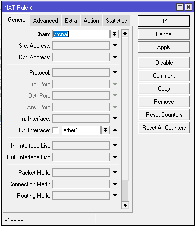
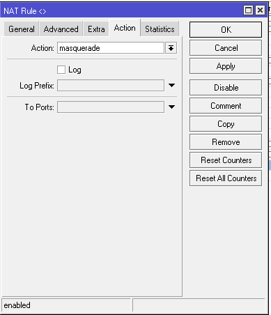
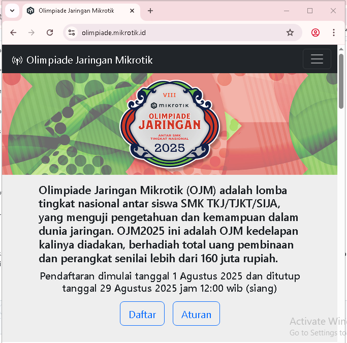
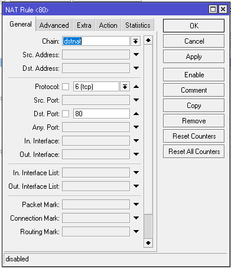
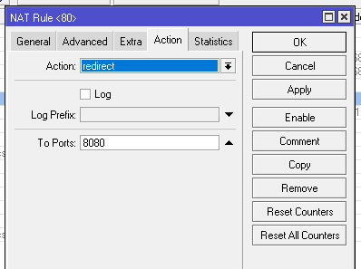
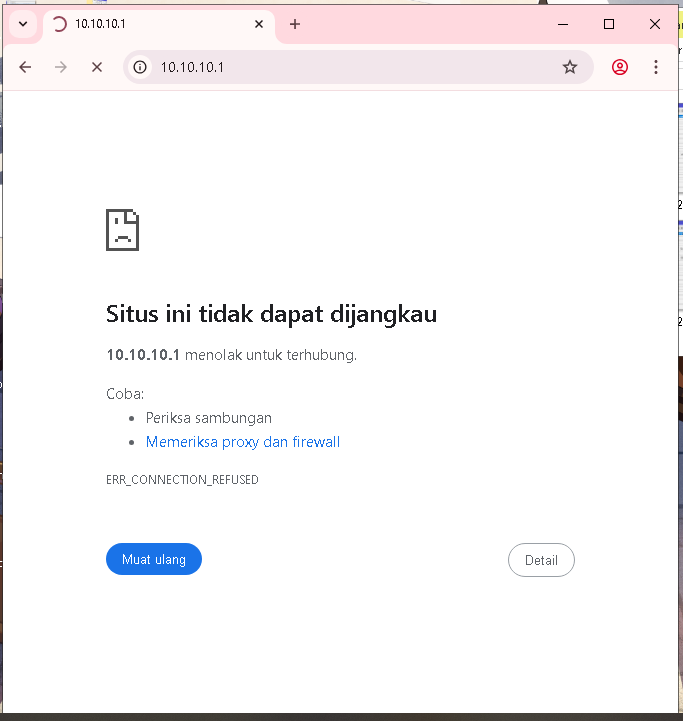
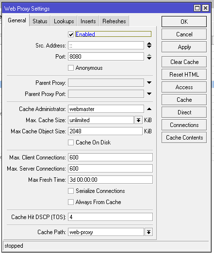

# LAB-47-FIREWALL-NAT
tanggal 27 agustus 2025

# Network Address Translation
Network address translation (nat) adalah proses mengubah alamat IP pada paket data saat paket tersebut melewati router atau firewall, agar bisa dikirim dengan benar antara jaringan privat (LAN) dan jaringan publik (seperti internet). serta bertujuan Menghubungkan jaringan lokal (IP privat) ke internet dan Menjaga keamanan jaringan internal. di firewall nat ini ada 2 chain utama yaitu :

**1. srcnat**     
yang berfungsi untuk mengubah alamat IP sumber (source address) dari paket data yang keluar dari jaringan privat ke jaringan publik (internet). 
**2. dstnat**     
(Destination Network Address Translation) adalah yang mengubah alamat IP tujuan (destination address) dari sebuah paket data. Fungsinya adalah untuk membuat server atau host dalam jaringan lokal dapat diakses dari luar jaringan (internet), misalnya melalui port forwarding.

**berikut beberapa action yang ada di firewal nat:** 

*1. masquerade*    
   digunakan untuk mengubah alamat IP privat di jaringan lokal menjadi satu alamat IP publik secara otomatis, cocok untuk ip yang dinamis/berubah ubah   
*2. same*    
   Mengubah IP sumber (source IP) seperti src-nat, tapi dengan upaya menjaga konsistensi pemetaan antara IP privat dan IP publik. Menjaga agar IP privat tertentu selalu diterjemahkan ke IP publik yang sama (jika ada lebih dari satu IP publik/ ip yang berubah ubah). serta Mencegah perubahan IP NAT (mapping) secara acak.      
*3. src-nat*    
   Mengganti alamat sumber/port paket ke nilai yang ditentukan (to-addresses, to-ports). Biasanya untuk menerjemahkan IP privat ke IP publik tertentu (static srcnat).    
*4. dst-nat*          
   untuk mengubah alamat tujuan (destination address) dari paket data yang masuk.     
*5. accept*        
   untuk mengizinkan paket data yang cocok dengan rule tersebut untuk diteruskan tanpa diblokir atau dimodifikasi.      
*6. redirect*         
   digunakan untuk mengalihkan (redirect) koneksi ke port tertentu di router itu sendiri, bukan ke perangkat lain di jaringan.     
*7. jump*          
   Digunakan untuk "melompat" ke chain (rantai) lain untuk melanjutkan pemrosesan aturan.    
*8. return*          
   Digunakan untuk kembali ke chain asal setelah selesai memproses di custom chain.    
*9. passthrough*           
   Membiarkan paket lolos ke rule selanjutnya di chain yang sama. tanpa memblokir atau mengubahnya.    
*10. add dst to address list*        
    ambahkan IP tujuan (destination) ke address list    
*11. add src to address list*         
    Tambahkan IP sumber (source) ke address list    
*12. log*        
    Mencatat paket yang cocok dengan rule ke log system Mikrotik.    
*13. netmap*           
     NAT 1:1 (Static NAT), cocok untuk mapping banyak IP publik ke lokal    

# konfigurasi firewall nat 
**1. masquerade**      
   di sini saya akan meggunakan action masquerade untuk melakukan konfigurasi kenpa saya memilih action ini karena saya akan Mengubah IP sumber (source IP) dari jaringan lokal menjadi IP publik router secara otomatis, agar perangkat di jaringan lokal bisa mengakses internet.
   pilih menu ip > firewall > nat 

*bisa dilihat sekarang kita sudah bisa terhubung ke internet*

**2. same**
    di sini saya akan 

**6. redirect** 
   disini saya akan mengalihkan konekis port 80 (http) ke 8080 (web proxy) 

bisa di lihat http tida bisa diakses langsung karena kita sudah memindahkan nya ke port 8080 (web proxy) maka dari itu kita aktifkan dulu web proxy di menu ip > web proxy > centang yang enabled.

*dan tadaa sekarang http bisa di akses*
